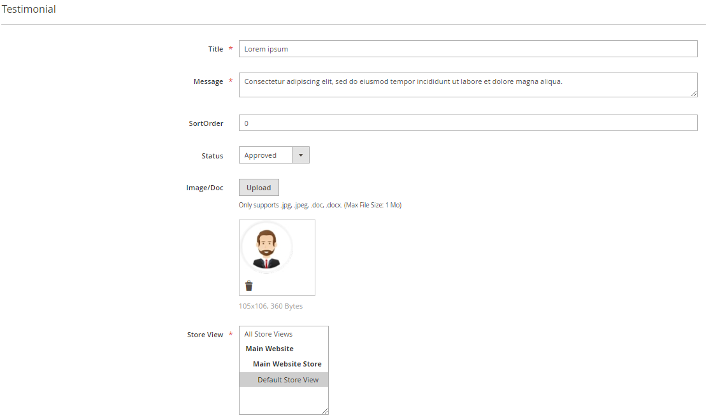

# Magento 2 TESTIMONIALS

This module adds an easy way to use testimonials in your Magento store. In this module, the admin can approve, disapprove, delete and update testimonials.

## Installation

- Create the following folders inside the Magento app folder
> `code/Egio/Testimonials`
- Download [.zip](https://github.com/zakaria-janah/magento-2-testimonials/archive/main.zip)
- The path should be **app/code/Egio/Testimonials**
- Extract the **.zip** files into the **Testimonials** folder

> php bin/magento module:enable Egio_Testimonials 
> php bin/magento setup:upgrade 
> php bin/magento setup:di:compile 
> php bin/magento setup:static-content:deploy 
> php bin/magento cache:clean 
> php bin/magento cache:flush 

The URL path to the testimonials page will be: http://example.com/testimonials/

## Configuration

The module can be enabled/disabled on **Stores -> Configuration -> EGIO EXTENSIONS -> Testimonials**

## Screenshots

